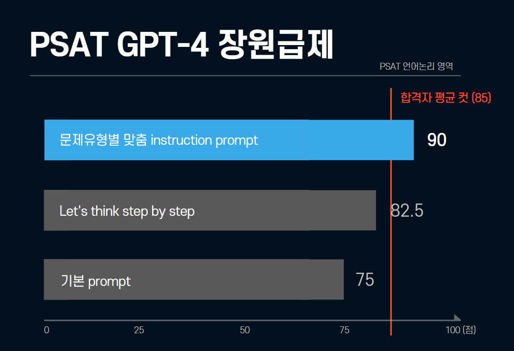

# PSATkiller

## Description

This project investigates the performance of OpenAI's ChatGPT, particularly GPT-4, in Korean language examinations via prompt engineering. We want to see how well GPT-4 can perform in a non-English context, particularly in logic-based examinations such as the PSAT.

## Method

The method involved a step-by-step approach:

| Step | Method                     | Description                                                                                                 |
| ---- | -------------------------- | ----------------------------------------------------------------------------------------------------------- |
| 1    | Basic Prompting            | Testing GPT-4 with basic prompts for questions with and without options in the PSAT language logic section. |
| 2    | Research-Based Prompts     | Using Several Prompt Engineering Techniques such as Zero-shot Chain-of-Thought and Instruction.             |
| 3    | Custom Instruction Prompts | Making and adding new prompts for specific problem types that were challenging.                             |

## Results

The initial basic prompting method surprisingly scored 75/100. However, to reach the passing score(85/100), further improvement was needed. The research-based prompts showed some improvement, especially in the zero-shot chain-of-thought method(82.5/100). Nevertheless, the custom instruction prompts are needed to reach the high level of logical reasoning. The custom instruction prompts, focusing on logical reasoning and contextual analysis for specific problem types, ultimately enabled GPT-4 to achieve a score of 90/100.

In the project, while custom prompts notably improved GPT-4's performance in the PSAT language logic section, challenges such as the generalizability of prompts, and the far complexities in certain question types like logic puzzles, highlighted the nuanced intricacies of AI's application in standardized tests.

You can feel free to contact @uyunho99 for more information.
